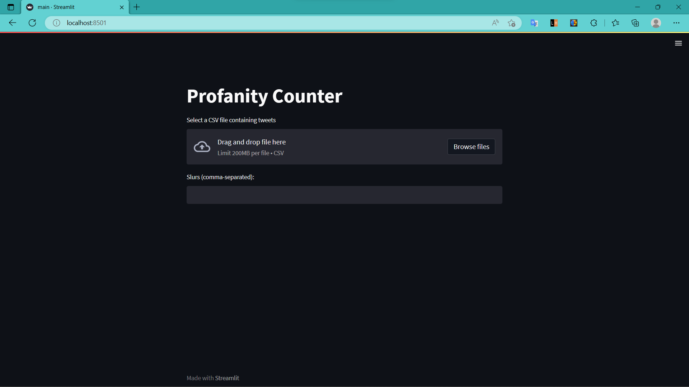

Profanity Counter

This application counts the number of racial slurs in each tweet in a CSV file and displays the profanity scores. It is implemented in Python using the Streamlit and pandas libraries.

Dependencies

To use the application, you will need to have the following libraries installed:

Streamlit
pandas
You can install these libraries using pip:

pip install streamlit pandas

Usage

To run the application, navigate to the directory containing the code and run the following command:

streamlit run profanity_counter.py

This will launch a web application in your default web browser. To use the application, select a CSV file containing tweets and enter the racial slurs to count (separated by commas). The application will display a table of profanity scores, one for each tweet in the file.

Input

Tweet File: A CSV file containing tweets. The file should have a column called "tweet" that contains the tweets.
Slurs: A list of racial slurs to count in the tweets, separated by commas.
Output

A table of profanity scores, one for each tweet in the file. The profanity score is the number of times a racial slur appears in the tweet.
Example
Input:

Tweet File:
tweets.csv
Slurs:
racial slur1, racial slur2
Output:

Tweet	Profanity Score
Tweet 1	0
Tweet 2	1
Tweet 3	2
...	...

